# Maestro

A cross-platform desktop app (Windows + macOS, Electron) for running CLI coding
agents (starting with **Claude Code**) in parallel, each in its own isolated Git
worktree, and reviewing/merging their work from one UI.

The product value is **orchestration and review** — the agents already exist as
CLIs; Maestro is the shell that runs them in isolation, shows their work, and
helps ship it.

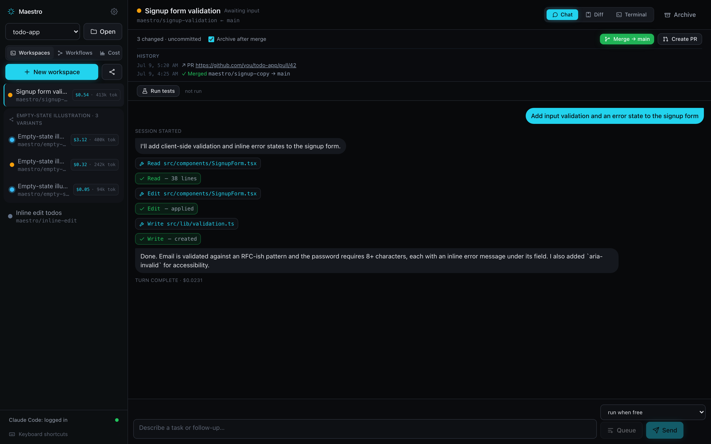

## Status

The core is built and verified: scaffold, orchestration engine, harness layer
(Claude Code + Codex), workspace supervisor, UI shell, Monaco diff viewer,
merge/PR/archive, a raw terminal per workspace (node-pty + xterm), agent
accounts (CLI login from Settings → Accounts), and persisted review history
(prior merges + PR links per workspace, surfaced in the ReviewBar).

The core loop — read the agent's turn, review the diff, ship it:

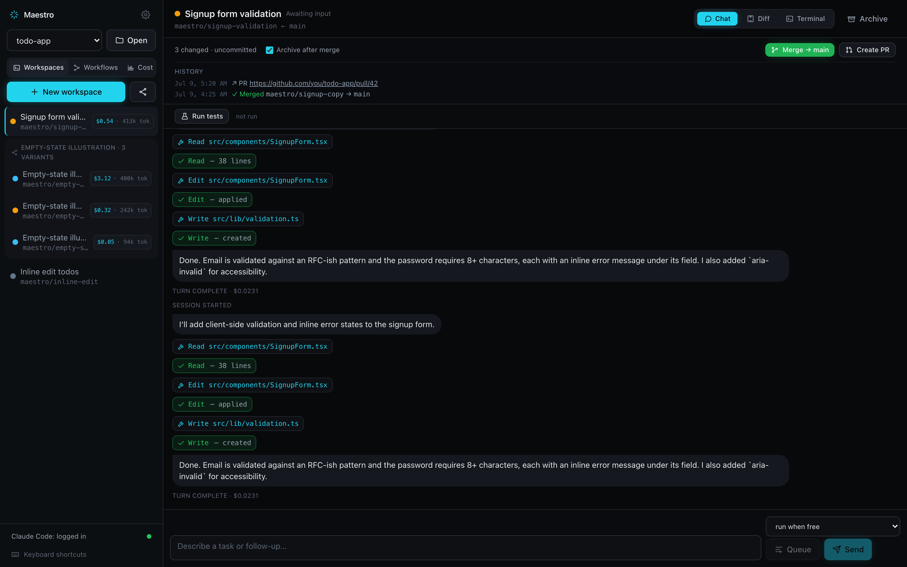

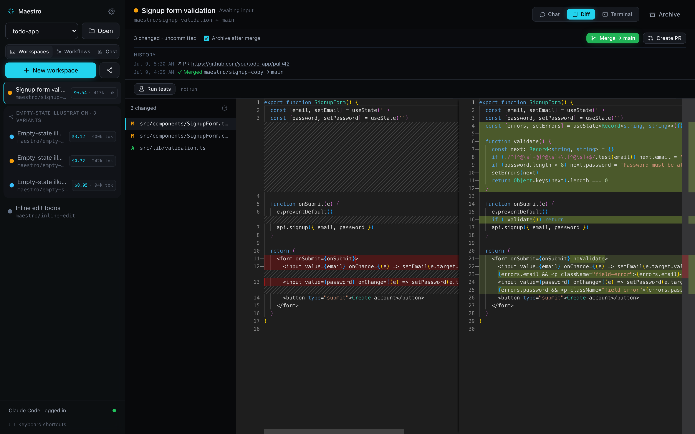

On top of that, four workflow features round out the "run many, ship one" loop:
**fan-out**, a **task queue**, a per-repo **test runner**, and a side-by-side
**comparison view** (see [Features](#features) below).

Each module has a headless smoke test: `npm run smoke:m1` … `smoke:m14` plus
`smoke:m4b` (run `npm run rebuild:node` first — see ABI note below; `smoke:m4b`
and `smoke:m7` work on either ABI — node-pty ships N-API prebuilds and the auth
probes don't touch the DB).

## Features

### Fan-out — try several agents/models at once

Turn one task into **2–5 parallel variants**, each running a different agent or
model in its own isolated worktree but sharing a `groupId`. Open the **Fan-out**
dialog, pick the variants, and Maestro spins them up side by side in the sidebar
(grouped under the task). When one variant wins, **"keep this · archive others"**
promotes it and archives the rest in a single click.

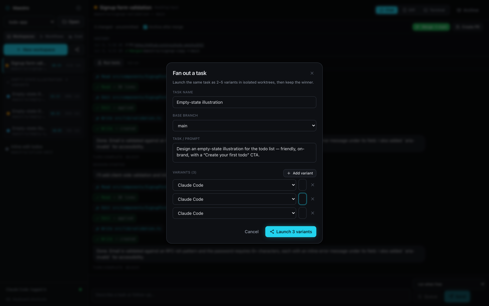

### Task queue — sequence work instead of babysitting it

A unified queue lets you line up runs instead of starting them by hand. Jobs run
**sequentially per workspace**, and you can **chain across workspaces** so one
job only starts after another finishes (`dependsOnWorkspaceId`). The AgentChat
shows queue chips and a **"run after"** dropdown; cancel or reorder anytime. The
queue pushes live `queue_changed` updates to the UI.

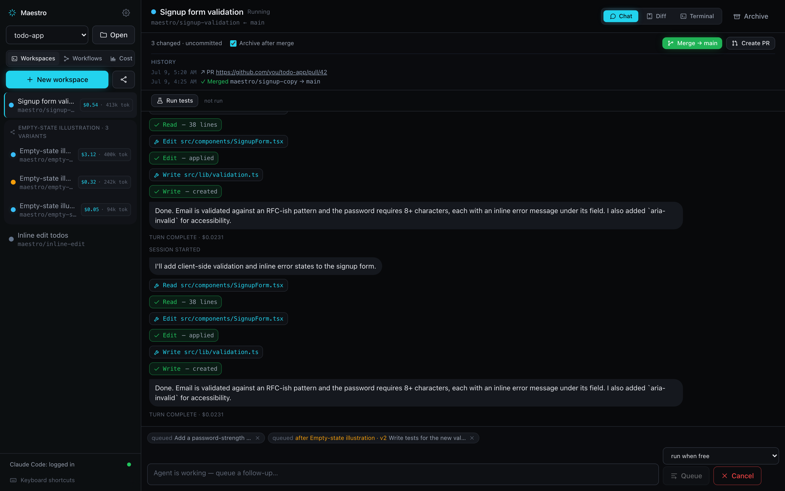

### Test runner — one click to know if a variant works

Configure a **test command per repository** (Settings → Repository). Each
workspace gets a **Run tests** bar that executes that command against the
variant's worktree, with a timeout and tail-capped output, and shows a
pass/fail **badge**. Results are kept per-workspace and timestamped so you can
tell at a glance which variant is green.

### Comparison view — judge variants side by side

When a task fanned out into a group, a **⑃ Compare** tab appears. It lays the
variants out together — each with its **status, diff size, last message, and
test badge** — and gives you **Run all**, **Open full diff**, and **Keep this**
so you can pick the winner without clicking through each one individually.

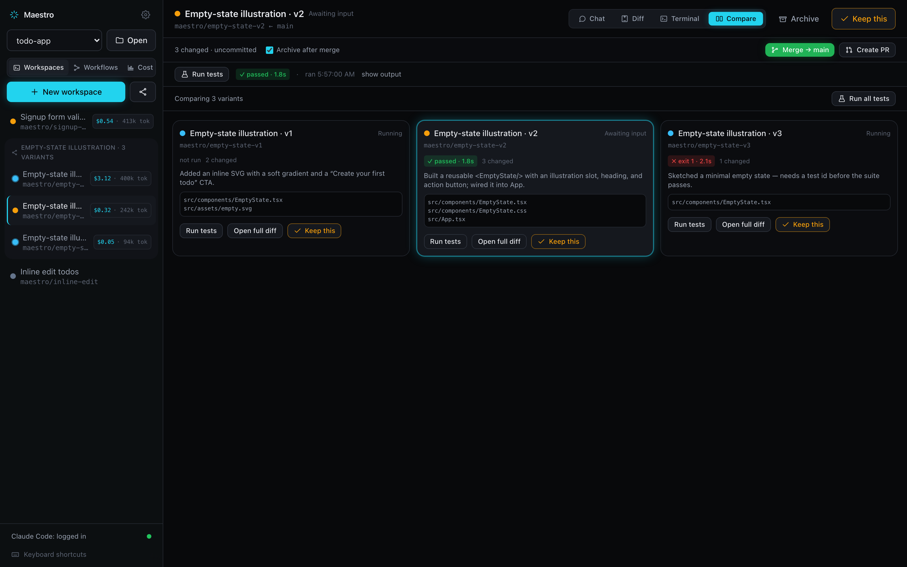

### Workflows — schedule dependent tasks as a DAG

Beyond flat fan-out, the **Workflows** tab runs a **directed-acyclic graph** of
tasks: each node is an agent run, edges are dependencies, and the scheduler
starts a task only once its parents finish (respecting a **max-concurrency**
cap). Node status flows through **blocked → running → completed → merged**, so a
diamond like *prep → (module A ∥ module B) → integrate* executes in the right
order on its own.

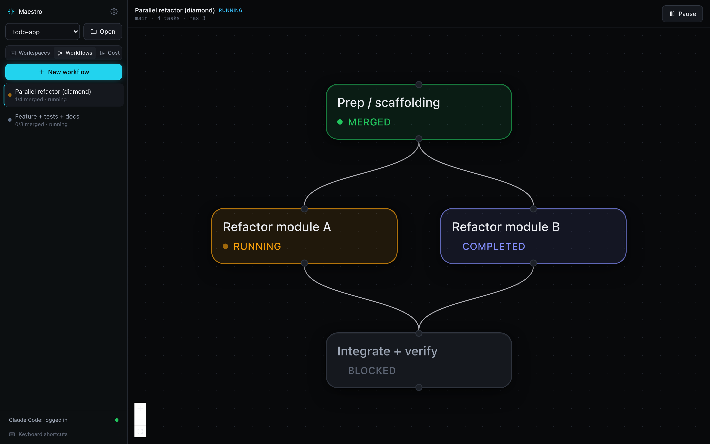

Selecting a node opens an **inspector** with its live output and, for finished
tasks, **approve / reject** controls; the **builder** dialog lets you compose the
graph (tasks, dependencies, per-task agent/model, base branch) and save it as a
reusable template.

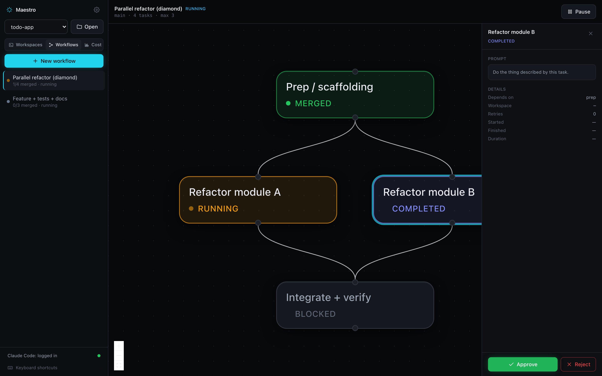

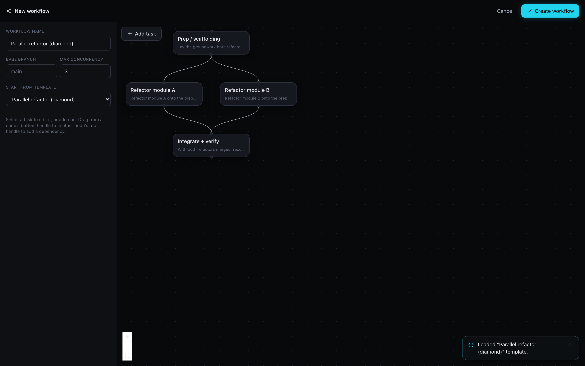

### Cost & usage dashboard — what a run is costing, live

The **Cost** tab rolls up **session cost, tokens, burn rate, and active agents**
into stat tiles, charts **cumulative cost by agent** over the session, and breaks
spend down **per agent** (model, in/out/cache tokens, status, duration) and **per
workflow**, with an all-sessions **history** you can date-filter. Rates are
shown with a verified-on date and can be refreshed.

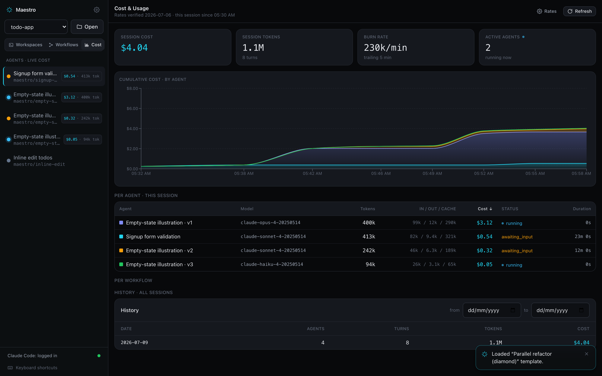

### Review, permissions & terminal

Merging is gated by a **ReviewBar** — create a PR or merge into the base branch,
with prior merges and PR links kept per workspace.


When an agent wants to run a tool that needs sign-off, Maestro surfaces an
**inline permission prompt** in the chat with **approve / reject**, so headless
runs never hang silently on a blocked tool.

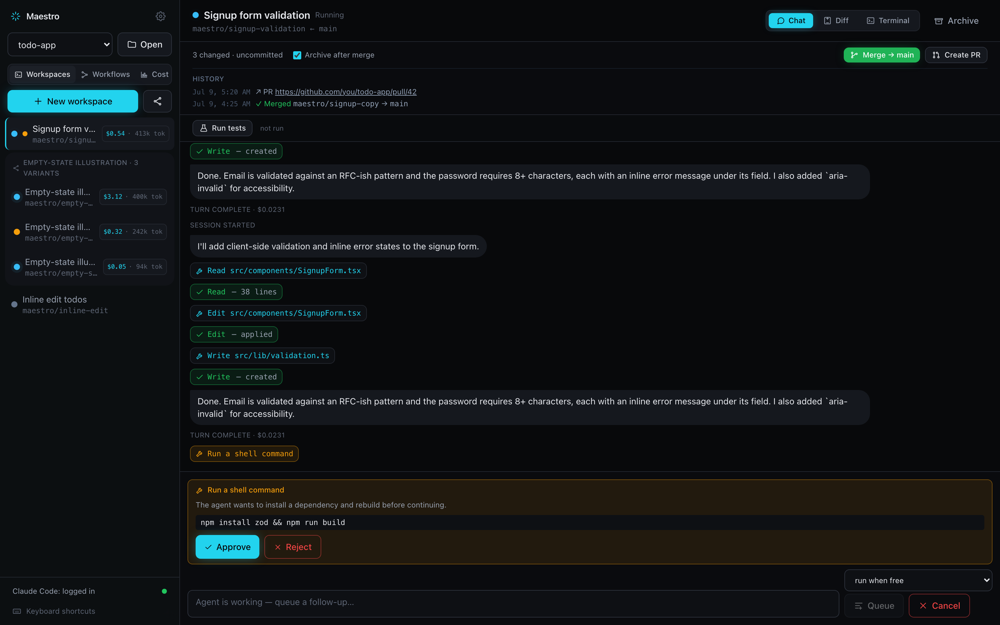

Every workspace also has a **raw terminal** (node-pty + xterm) scoped to that
variant's worktree, for the moments you want to poke around by hand.

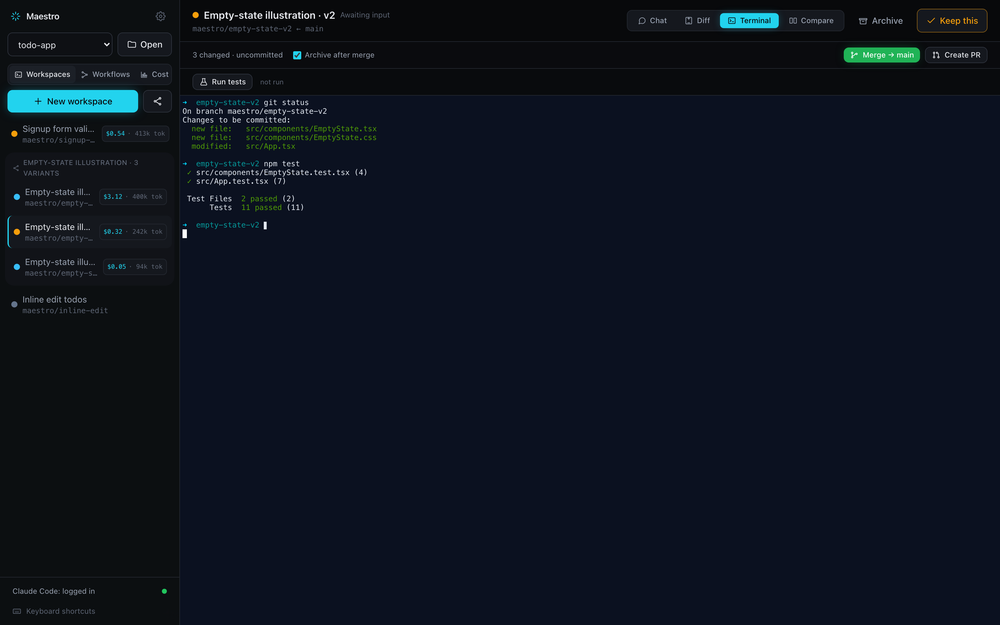

## Agent accounts (login)

Maestro runs each agent through its **own CLI login** — your Claude Pro/Max or
ChatGPT subscription stays with the provider and **no tokens are stored in
Maestro**. Open **Settings → Accounts** (gear button in the sidebar) to:

- See whether each agent CLI is **installed** and **logged in**
  (`claude auth status`, `codex login status`).
- Click **Log in** to run the CLI's own sign-in flow (`claude auth login`,
  `codex login`) in an embedded terminal; it may open your browser to finish
  OAuth. Status re-checks automatically when the flow ends.

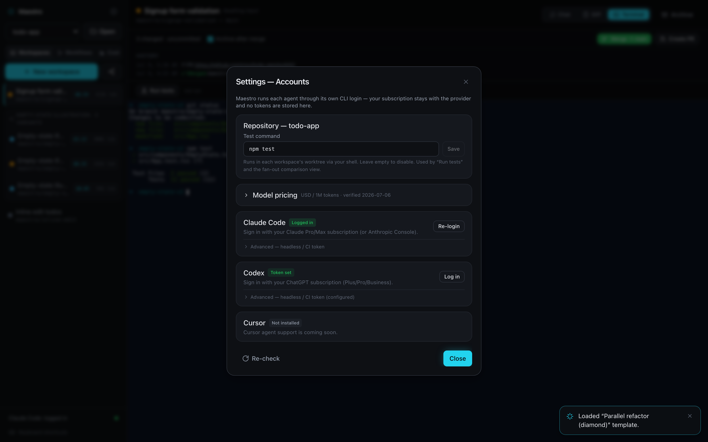

Credentials are owned by each CLI (OS keychain / dotfiles); Maestro only detects
login state and never injects tokens into the agent's environment.

**Advanced (headless / CI).** For machines that can't run an interactive login,
each agent's **Advanced** section accepts a pasted token or API key
(`claude setup-token` OAuth token, Anthropic API key, or OpenAI API key). It's
encrypted at rest with Electron `safeStorage` (OS keychain), kept **write-only**
(you can save or remove it, but it's never shown again), and injected as the
appropriate env var (`CLAUDE_CODE_OAUTH_TOKEN` / `ANTHROPIC_API_KEY` /
`OPENAI_API_KEY`) only when an agent spawns. Prefer the CLI login above whenever
you can.

## Native modules & ABI (important for dev)

`better-sqlite3` is a native module and must match the ABI of whatever runs it:

- **Running the app** (`npm run dev` / packaged) needs the **Electron** ABI:
  run `npm run rebuild:electron` once (after install, or after switching back from
  smoke tests).
- **Running the engine smoke tests** (`npm run smoke:m1/2/3`, plain Node via tsx)
  needs the **Node** ABI: run `npm run rebuild:node` first.

Switching between the two requires re-running the matching rebuild. `npm install`
leaves it on the Node ABI.

## Architecture

```
maestro/
├── shared/            # types + zod schemas shared across main/preload/renderer
├── src/
│   ├── main/          # Electron main process — the engine (fs, git, processes)
│   │   ├── ipc/       # ipcMain handlers — validate payload + delegate
│   │   ├── engine/    # GitService, WorktreeManager, WorkspaceSupervisor, store
│   │   └── harness/   # Harness interface + Claude Code impl + stubs
│   ├── preload/       # contextBridge: exposes typed `window.maestro`
│   └── renderer/      # React + Tailwind + Zustand UI
```

Security posture (hard constraints):

- All `fs` / `child_process` / `node-pty` access lives in **main** only.
- Renderer is sandboxed (`contextIsolation: true`, `nodeIntegration: false`,
  `sandbox: true`) and talks to main only through the typed preload bridge.
- Every IPC payload and parsed agent event is validated with **zod**.
- TypeScript strict mode; no `any`.

## Scripts

| Command | What it does |
|---|---|
| `npm run dev` | Launch the app with HMR (electron-vite dev). |
| `npm run typecheck` | Strict type-check main+preload and renderer. |
| `npm run build` | Typecheck + bundle main/preload/renderer to `out/`. |
| `npm run package:win` | Build + produce a Windows NSIS installer in `dist/`. |
| `npm run package:mac` | Build + produce an **unsigned arm64 `.dmg`** in `dist/` (see below). |
| `npm run package:dir` | Build + produce an unpacked app dir (fast, no installer). |
| `npm run screenshots` | Regenerate the docs images into `docs/img/` (headless, mocked bridge). Pass a filter, e.g. `-- diff`, to shoot a subset. |

## Cross-platform notes

Paths are always built with Node's `path` module and `os.homedir()` — never
hardcoded `/` or `~`. Git output is split on `/\r?\n/`.

## Distributing the macOS build

`npm run package:mac` produces an **unsigned, Apple Silicon (arm64)** `.dmg` at
`dist/Maestro-<version>-arm64.dmg`. Rebuild the native module for Electron's ABI
first, or the app crashes on launch:

```bash
npm run rebuild:electron && npm run package:mac
```

Because the build is unsigned (no Apple Developer ID), macOS Gatekeeper blocks it
on other machines with *"Maestro is damaged and can't be opened."* This is the
unsigned-app block, not a real error. Each recipient does this **once**:

1. Open the `.dmg` and drag **Maestro** into **Applications**.
2. In Terminal, strip the download quarantine flag:
   ```bash
   xattr -dr com.apple.quarantine /Applications/Maestro.app
   ```
3. Launch Maestro from Applications as normal.

Notes:

- **Apple Silicon only.** The build targets `arm64`; Intel Macs aren't covered.
  Add `x64` (or a `universal` target) in `electron-builder.yml` if you need them.
- **Agent CLIs aren't bundled.** Maestro orchestrates external coding-agent CLIs
  (Claude Code, Codex); recipients install and log in to those separately
  (Settings → Accounts).
- A signed + notarized build (Apple Developer Program, $99/yr) would remove the
  Gatekeeper step entirely — left as a later step.
